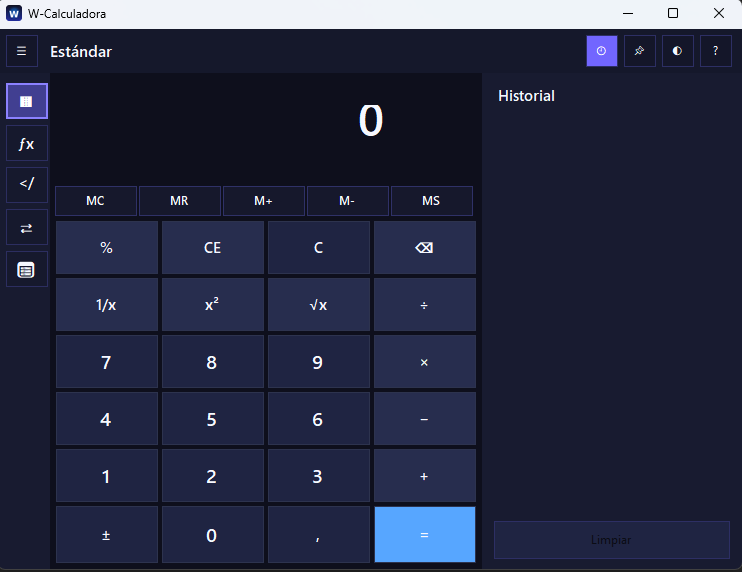
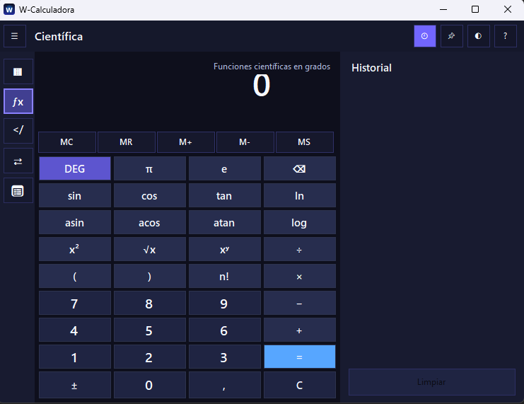
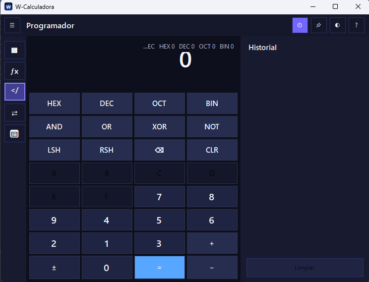

# W-Calculadora

  

  <b>Calculadora moderna para Windows inspirada en la calculadora clásica de Microsoft.</b>

  Oscura · Rápida · Portable · Profesional

---

## ✨ Características

### 🧮 Calculadora estándar
- Operaciones básicas rápidas
- Historial integrado
- Atajos de teclado
- Interfaz responsive

### 🔬 Modo científico
- Expresiones completas
- Paréntesis anidados
- Funciones trigonométricas
- `sin`, `cos`, `tan`
- `log`, `ln`
- `π`, `e`
- Factorial
- DEG / RAD

### 💻 Modo programador
- HEX / DEC / OCT / BIN
- AND / OR / XOR / NOT
- Shift lógico
- Conversión automática de bases

### 🔄 Conversores
- Moneda
- Longitud
- Volumen
- Fecha

---

## 🎨 Interfaz

W-Calculadora utiliza un diseño oscuro inspirado en Windows 11 con:
- Temas personalizables
- Animaciones suaves
- Historial lateral
- Notificaciones tipo toast
- Display adaptable inteligente

---

## 📸 Capturas

### Modo estándar

### Modo científico

### Modo programador

---

## 🚀 Actualizaciones automáticas

La aplicación puede comprobar nuevas versiones directamente desde GitHub.

Opciones:
- Actualizar ahora
- Recordar más tarde
- Cancelar

---

## 📦 Instalación

### Instalador
Descarga la última versión desde:

👉 https://github.com/FsDk-es/W-Calculadora

### Portable
También disponible en formato portable sin instalación.

---

## 🛠 Tecnologías utilizadas

- C#
- .NET 8
- Windows Forms
- Inno Setup

---

## 👨‍💻 Autor

**FsDk — Jose Antonio Giménez Cayuela**

Proyecto desarrollado como una alternativa moderna y elegante a las calculadoras clásicas de Windows.

---

## 📄 Licencia

Este proyecto se distribuye únicamente con fines educativos y personales.
